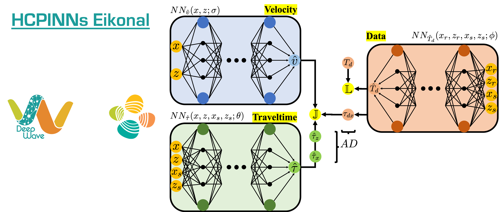

  

Reproducible material for **A robust seismic tomography framework via physics-informed machine learning with hard constrained data - Taufik M. and Alkhalifah T.**


# Project structure
This repository is organized as follows:

* :open_file_folder: **asset**: folder containing logo.
* :open_file_folder: **data**: folder containing the cropped [Marmousi](https://wiki.seg.org/wiki/Dictionary:Marmousi_model) model.
* :open_file_folder: **notebooks**: set of jupyter notebooks reproducing the experiments in the paper (see below for more details).
* :open_file_folder: **scripts**: set of (bash and python) scripts used to run multiple experiments.
* :open_file_folder: **src**: folder containing materials for the *hcpinnseikonal* package.

## Notebooks
The following notebooks are provided:

- :orange_book: ``Example-1.ipynb``: notebook performing a surface tomography acquisition with sparse source-receiver sampling.

## Scripts
The following scripts are provided:

- :page_with_curl: ``example-1.sh``: script to perform different receiver sampling experiment for the acquisition perform in the ``Example-1.ipynb`` and ``example-1.py``.

## Getting started
To ensure reproducibility of the results, we suggest using the `environment.yml` file when creating an environment.

Simply run:
```
./install_env.sh
```
It will take some time, if at the end you see the word `Done!` on your terminal you are ready to go. 

Remember to always activate the environment by typing:
```
conda activate my_env
```

**Disclaimer:** All experiments have been carried on a Intel(R) Xeon(R) Gold 6230R CPU @ 2.10GHz equipped with a single NVIDIA Quadro RTX 8000 GPU. Different environment 
configurations may be required for different combinations of workstation and GPU.

## Cite us 
DWXXX - Taufik and Alkhalifah (2022) A robust seismic tomography framework via physics-informed machine learning with hard constrained data - Taufik M. and Alkhalifah T.
